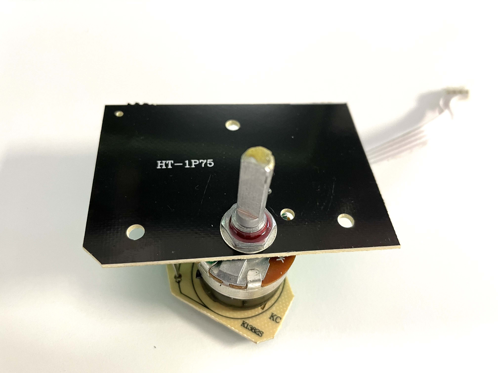
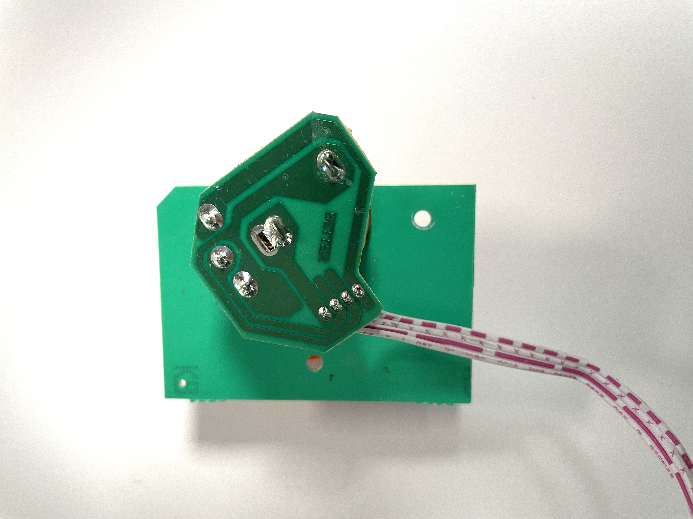

# HendiControl

## Reverse engineering

### PCB Display

Vorderseite *BETTER BT-350Q_DIS(V05) SH13383 15.10.22*

Rückseite

Der auf der Rückseite verbaute IC trägt die Bezeichnung __SM1628__. Nach einer ersten Rechereche handelt es sich dabei um einen LED Displaycontroller.
* [Datenblatt SM1628](docu/SM1628.PDF)

### PCB Poti

Vorderseite *HT-1P75*

Rückseite *BETTER*

Verbaut ist ein 500K Poti

### Schaltplan

* [Schaltplan Display u. Poti](reverse_engineering/Schematic_UI.pdf)
