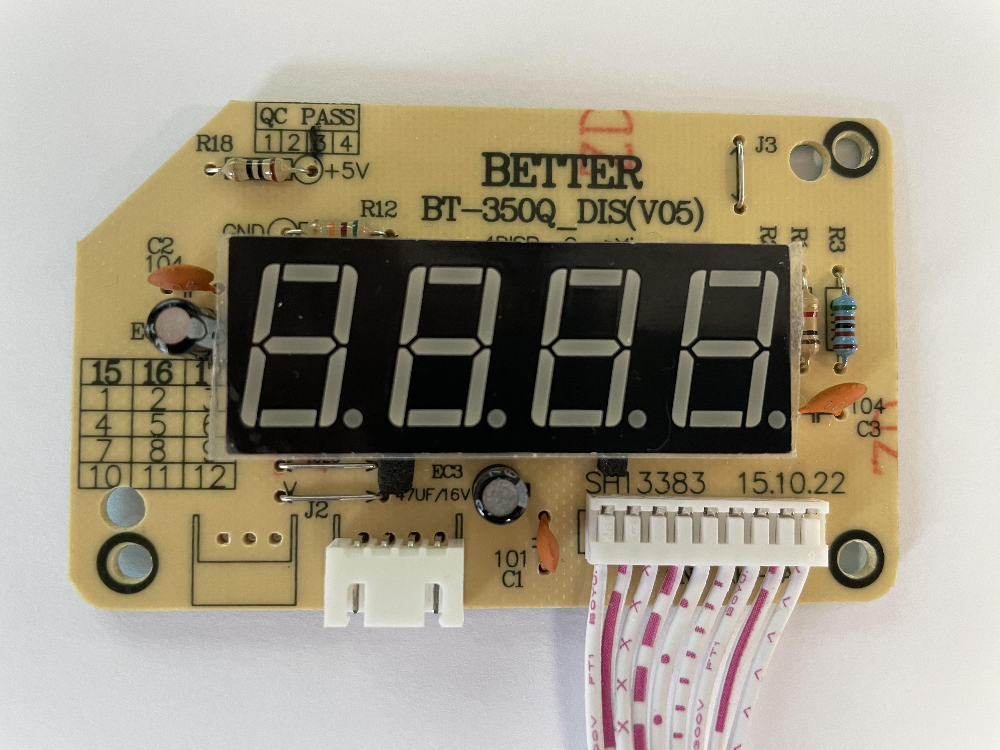
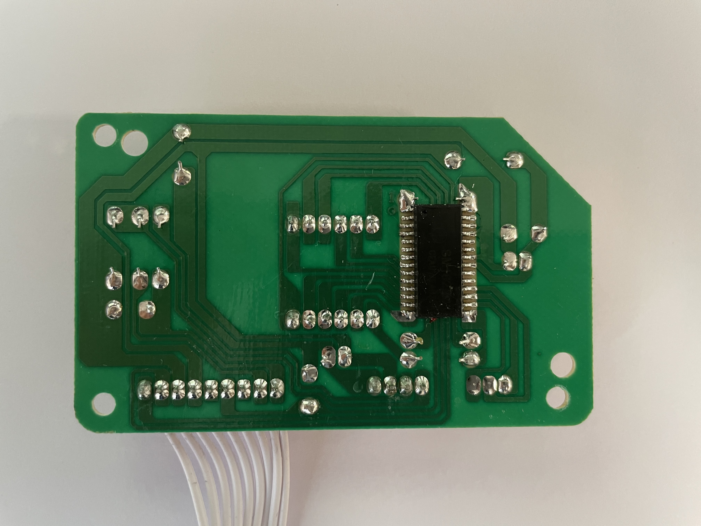

# HendiControl

## Reverse engineering

### PCB Display

Vorderseite

Rückseite

Der auf der Rückseite Verbaute IC trägt die Bezeichnung __SM1628__. Nach einer ersten Rechereche handelt es sich dabei um einen LED Displaycontroller.
* [Datenblatt SM1628](docu/SM1628.pdf)
