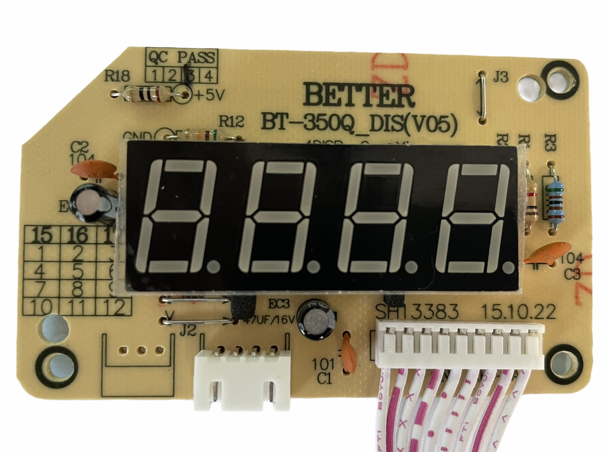
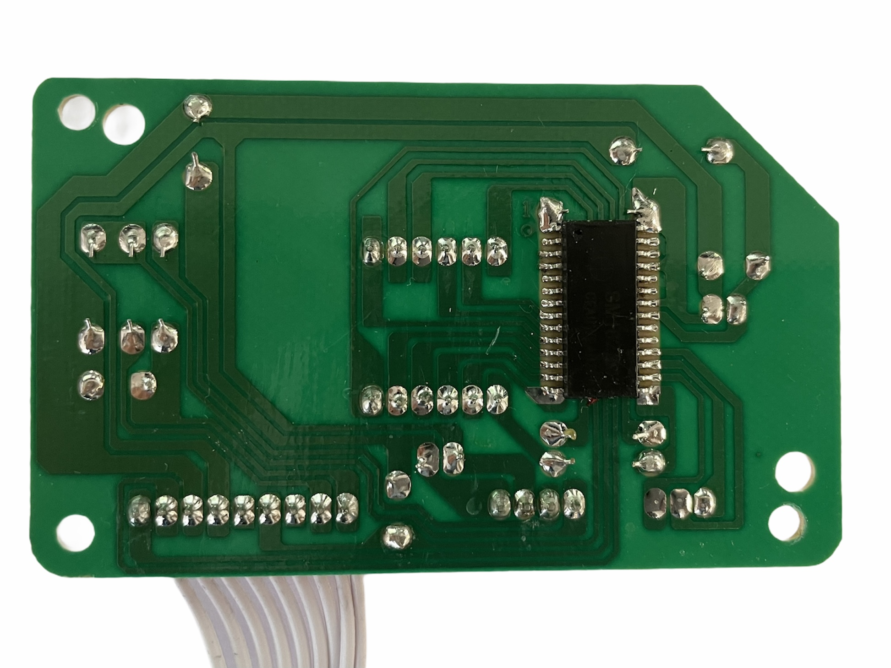
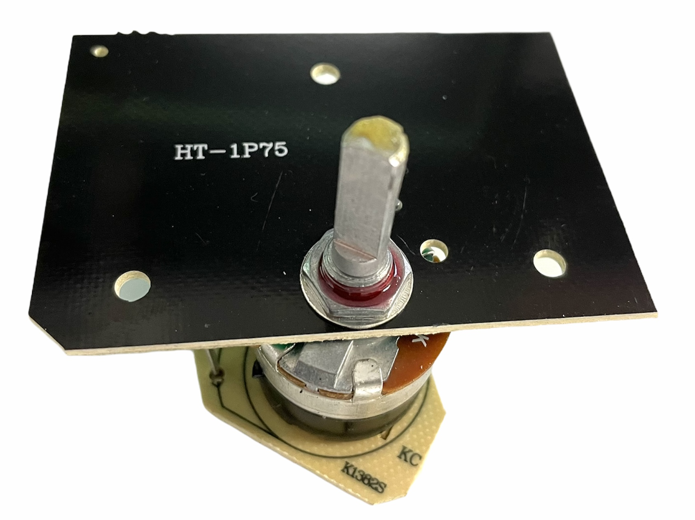
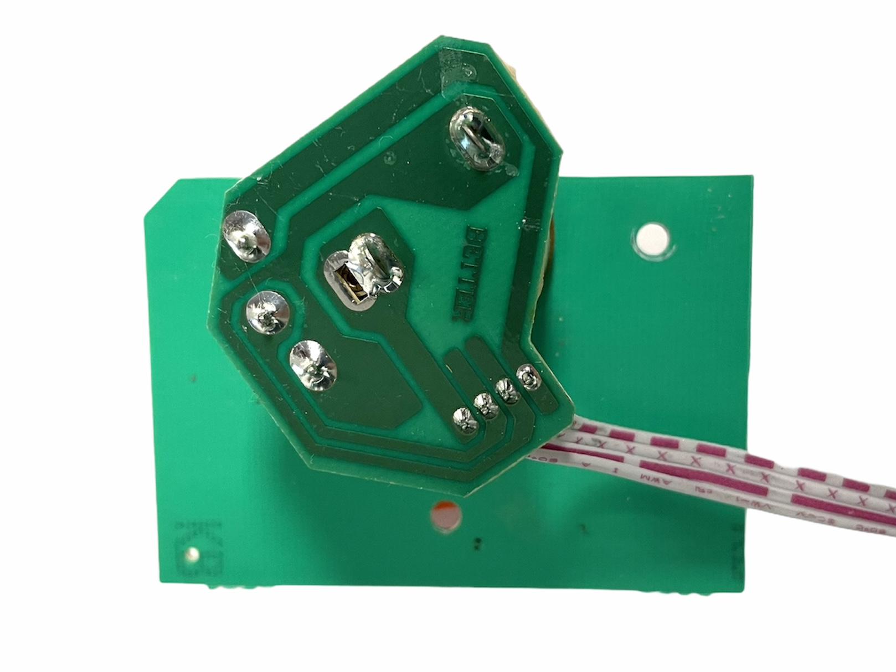

# HendiControl

## Reverse engineering

### PCB Display

Vorderseite *BETTER BT-350Q_DIS(V05) SH13383 15.10.22*

Rückseite

Der auf der Rückseite verbaute IC trägt die Bezeichnung __SM1628__. Nach einer ersten Rechereche handelt es sich dabei um einen LED Displaycontroller.
* [Datenblatt SM1628](docu/SM1628.PDF)

### PCB Poti

Vorderseite *HT-1P75*

Rückseite *BETTER*

Verbaut ist ein 500K Poti

### Schaltplan

* [Schaltplan Display u. Poti](reverse_engineering/Schematic_UI.pdf)

| U [V] | P [W] |
|-------|-------|
| 0     | 3500  |
| 5     | 500   |

### Nützliche Links

* [craftbeerpi Wiki - Hendi-Induction-cooker-model-3500-M--Setup](https://github.com/Manuel83/craftbeerpi/wiki/Hendi-Induction-cooker-model-3500-M--Setup)
